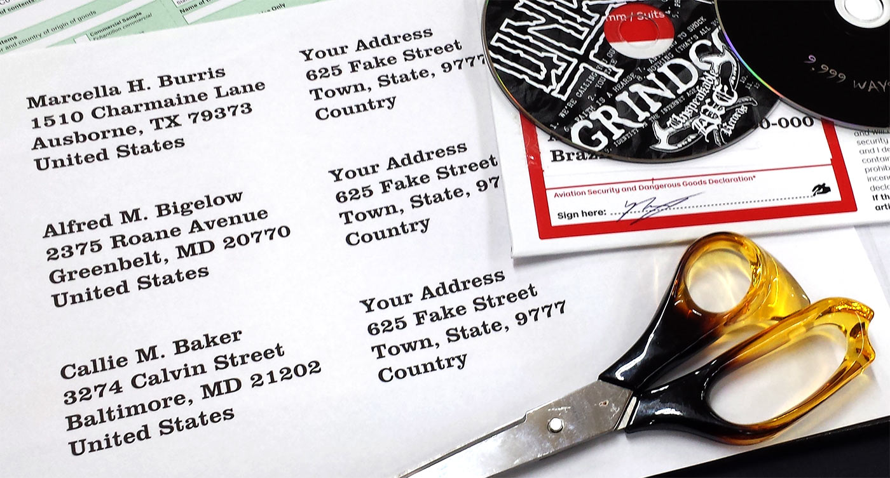

Address Printer
===============

Little toy I wrote to print off address-labels for sticking on parcels or envelopes.

#### Usage
Just run `make` and follow the instructions.
You'll end up with a PostScript file you can print at your leisure.

#### Requirements
* [GhostScript](http://www.ghostscript.com/)
* [GNU Make](www.gnu.org/software/make/manual/make.html)
* [GNU Troff](https://www.gnu.org/software/groff/)
